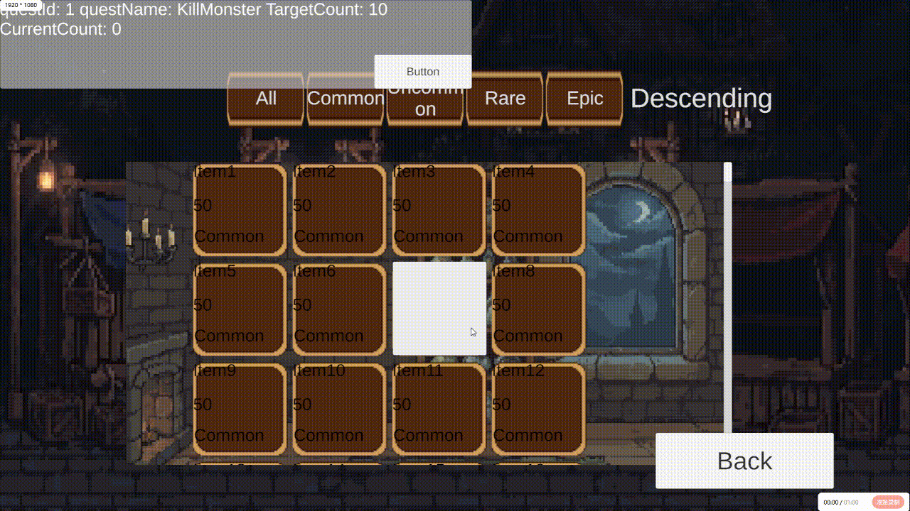

# CommercialUIFrameworkDemo

一个基于 **Unity + C# + UGUI** 实现的 Unity 客户端 UI 框架实战项目。

本项目以游戏客户端常见 UI 场景为背景，独立实践 **UI 管理、页面导航、虚拟化列表、事件通信、对象复用、红点系统以及 UI 性能分析** 等技术。

项目重点不是追求完整的商业框架，而是通过实际功能实现，理解 Unity 客户端中 **UI 模块组织、数据与 UI 解耦、模块间事件通信以及 UI 性能基础优化**。

> **项目定位：个人 Unity 客户端开发实战 / 学习项目**

---

## 项目演示

### GIF 演示



### Windows Demo

提供 Windows 可运行版本。

下载 GitHub Release 中的：

`CommercialUIFrameworkDemo-Windows.zip`

解压后运行：

`CommercialUIFrameworkDemo.exe`

---

## 核心功能

### 1. UI 管理与页面导航

实现基础 UI 管理框架：

* `UIManager` 统一管理 UI Panel
* 使用 `Dictionary<Type, BasePanel>` 缓存 Panel
* 使用 `Stack<BasePanel>` 管理页面导航历史
* 支持页面打开、关闭、返回
* 基于 `CanvasGroup` 控制 UI 显示、隐藏及交互状态
* 支持不同 UI Layer：

```text
Background
Normal
Popup
Top
```

基础 Panel 生命周期：

```text
OnEnter
OnPause
OnResume
OnExit
```

同时通过 `UseStack` 控制页面是否参与 UI 返回栈。

---

### 2. ScrollRect 虚拟化列表

针对背包等长列表场景，实现基于 `ScrollRect` 的 UI 虚拟化。

核心思路：

```text
ScrollRect
    ↓
计算当前可视区域
    ↓
计算 Data Index
    ↓
复用固定数量 ItemCell
    ↓
重新绑定可视区域数据
```

特点：

* 不为所有数据创建 UI GameObject
* 固定数量 `ItemCell` 循环复用
* 根据滚动位置计算当前可视数据索引
* `Data Index` 与 `Cell Index` 分离
* 列表末尾处理无数据 Cell，避免旧数据残留

该部分主要用于实践 Unity 客户端中常见的长列表优化思路。

---

### 3. EventBus 事件通信

实现基于事件类型的简单 EventBus，用于不同模块之间的事件通信。

支持：

```text
Subscribe
UnSubscribe
Publish
```

项目中通过事件进行模块间通信，例如：

```text
ItemObtainedEvent
MonsterKilledEvent
ItemViewedEvent
```

减少 UI 模块之间的直接依赖。

同时实践 Panel 生命周期中的事件订阅与取消订阅，避免重复订阅以及对象生命周期结束后仍然接收事件的问题。

---

### 4. ObjectPool 对象复用

实现基础泛型对象池：

```text
Get
Release
```

用于实践对象复用思想，减少频繁创建和销毁对象带来的开销。

在项目中，ObjectPool 与虚拟列表的 Cell 复用分别承担不同职责：

```text
Virtualized List
    ↓
负责列表中的 Cell 复用与数据索引映射

ObjectPool
    ↓
提供通用对象 Get / Release 能力
```

---

### 5. RedDotSystem

实现基础红点节点结构。

核心结构：

```text
RedDotNode
├── Parent
├── Children
├── HasRedDot
└── OnStateChanged
```

红点状态变化流程：

```text
叶子节点状态变化
        ↓
通知父节点
        ↓
父节点根据子节点状态更新
        ↓
继续向上传播
```

用于实践游戏客户端中常见的红点状态聚合思路。

同时结合：

```text
ItemViewedEvent
```

处理道具查看后的红点状态更新。

---

### 6. 背包系统

实现基础背包数据与 UI：

* ItemData
* InventoryData
* ItemCell
* InventoryPanel
* ItemDetailPanel

支持：

* 道具列表展示
* 道具数量
* 道具品质
* 分类筛选
* 品质 / 数量排序
* 道具详情
* 新道具红点提示

示例道具品质：

```text
Common
Uncommon
Rare
Epic
```

---

### 7. 任务系统

通过事件驱动任务状态更新。

例如：

```text
击杀怪物
    ↓
MonsterKilledEvent
    ↓
QuestSystem / QuestPanel
    ↓
任务进度更新
```

通过 EventBus 进行模块之间的事件通知，避免 UI 直接依赖具体的游戏逻辑模块。

---

## 项目架构

整体结构围绕 Unity 客户端常见 UI 模块进行组织：

```text
                    ┌───────────────┐
                    │   UIManager   │
                    └───────┬───────┘
                            │
                 ┌──────────┴──────────┐
                 │                     │
          ┌──────▼──────┐       ┌──────▼──────┐
          │  BasePanel  │       │   UI Stack  │
          └──────┬──────┘       └─────────────┘
                 │
        ┌────────┼────────┐
        │        │        │
       Main   Inventory  ItemDetail
                 │
                 │
          ┌──────▼───────┐
          │ Virtual List │
          └──────┬───────┘
                 │
              ItemCell
                 │
                 ▼
             ItemData
```

模块之间通过 EventBus 进行事件通信：

```text
Game/Data
    │
    │ Publish Event
    ▼
 EventBus
    │
    ├──────────────► Inventory
    │
    ├──────────────► Quest
    │
    └──────────────► RedDotSystem
```

---

## 数据与 UI 通信

项目中尽量避免让不同 UI 模块直接互相调用。

例如道具获得：

```text
获得道具
    ↓
发布 ItemObtainedEvent
    ↓
EventBus
    ↓
Inventory 接收事件
    ↓
更新数据
    ↓
刷新相关 UI
```

道具查看：

```text
点击道具
    ↓
Mark Item Viewed
    ↓
ItemViewedEvent
    ↓
RedDotSystem
    ↓
更新对应红点状态
```

这种方式可以降低模块之间的直接耦合，使 UI 和业务逻辑之间的关系更加清晰。

---

## UI 性能实践

项目中针对 Unity UGUI 常见性能问题进行了基础实践和分析。

### Raycast Target

对于不需要参与 UI 交互检测的装饰性 Image，关闭：

```text
Raycast Target
```

减少不必要的 UI Raycast 候选。

---

### Canvas 分层

根据 UI 的更新频率、功能范围以及是否需要独立重建等因素考虑 Canvas 划分。

重点理解：

```text
Canvas Rebuild
≠
Draw Call
```

Canvas 拆分并不是越多越好，需要结合实际 UI 结构进行分析。

---

### Sprite Atlas

使用 Sprite Atlas 对 UI Sprite 进行统一管理。

通过实际测试观察 Sprite 资源使用情况下的 Batches 变化，理解 UI 图集与批处理之间的关系。

---

### Unity Profiler

使用 Unity Profiler 对 UI 运行情况进行基础分析。

重点观察：

```text
CPU Usage
    ├── PlayerLoop
    ├── UpdateCanvasRectTransform
    ├── PostLateUpdate.PlayerUpdateCanvases
    └── Layout
```

通过 Profiler 理解 UI Layout、Canvas Rebuild 等操作可能产生的 CPU 开销。

---

## 项目结构

```text
CommercialUIFrameworkDemo
├── Assets
│   ├── Art
│   │   └── Test
│   │
│   ├── Scenes
│   │   └── Main.unity
│   │
│   └── Scripts
│       ├── Event
│       ├── RedDpt
│       ├── RedDotSystem
│       └── BatchTest.cs
│
├── Docs
│   └── demo.gif
│
├── Packages
├── ProjectSettings
├── README.md
└── .gitignore
```

---

## 技术栈

* Unity
* C#
* UGUI
* Canvas / CanvasGroup
* CanvasScaler
* ScrollRect
* Layout Group
* EventBus
* ObjectPool
* UI Stack
* RedDotNode
* Sprite Atlas
* Unity Profiler
* Git

---

## 运行方式

### Unity Editor

使用 Unity 打开项目：

```text
CommercialUIFrameworkDemo
```

打开场景：

```text
Assets/Scenes/Main.unity
```

运行即可。

### Windows

下载 Release 中的：

```text
CommercialUIFrameworkDemo-Windows.zip
```

解压后运行：

```text
CommercialUIFrameworkDemo.exe
```

---

## 项目实践重点

本项目重点实践以下 Unity 客户端开发问题：

### UI 管理

```text
如何统一管理多个 Panel？
如何处理 Panel 生命周期？
如何实现 UI 返回？
如何区分不同 UI 层级？
```

### 长列表

```text
为什么不能为 10000 条数据创建 10000 个 UI？
如何计算当前可视数据？
如何复用 ItemCell？
Data Index 与 Cell Index 如何对应？
```

### 模块通信

```text
UI 如何接收业务事件？
为什么使用 EventBus？
如何避免重复订阅？
什么时候 Subscribe / UnSubscribe？
```

### UI 性能

```text
Raycast Target 有什么影响？
Canvas Rebuild 是什么？
Draw Call / Batching 与 Canvas Rebuild 有什么区别？
Sprite Atlas 能解决什么问题？
什么时候需要考虑 Canvas 拆分？
```

---

## 项目收获

通过本项目进一步熟悉了 Unity 客户端 UI 开发中的常见模块与设计思路，包括：

* UIManager 与 Panel 生命周期管理
* Stack 页面导航
* UGUI 动态布局
* ScrollRect 虚拟化列表
* ItemCell 数据绑定与复用
* EventBus 事件通信
* 基础 ObjectPool
* RedDotNode 状态传播
* UI Raycast 与 Canvas 基础性能问题
* Sprite Atlas
* Unity Profiler 基础分析

同时通过 Git 对项目进行版本管理，并制作 Windows 可运行版本和项目演示 GIF，用于展示完整的 Unity 客户端开发实践过程。

---

## 项目定位

**CommercialUIFrameworkDemo 是一个面向 Unity 客户端开发学习与求职展示的个人实战项目。**

项目重点在于通过实际功能理解：

> **UI 管理 → 数据驱动 → 事件通信 → UI 复用 → 性能分析**

而不是构建一个完整的商业级 UI 框架。
